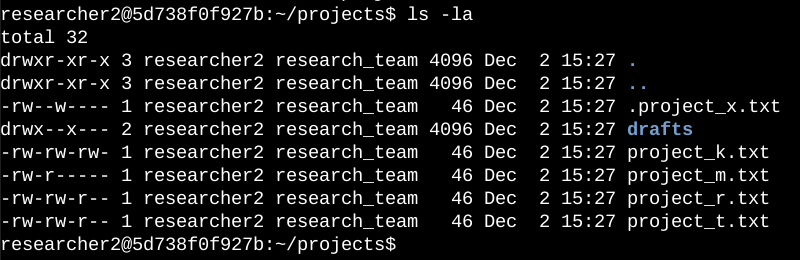
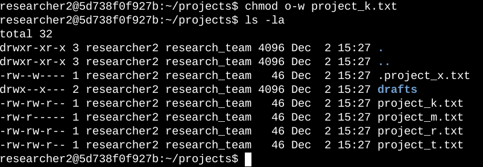
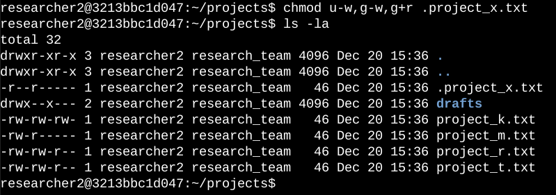
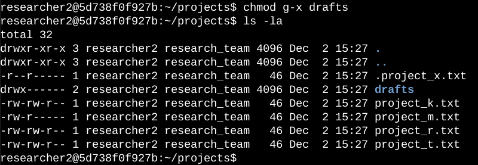

# Autorisations de fichiers sous Linux

## Description du projet

L’équipe de recherche de mon organisation doit mettre à jour les autorisations de certains fichiers et répertoires dans le répertoire `projects`. Les autorisations actuelles ne correspondent pas au niveau d’accès qui devrait être accordé. La vérification et la mise à jour de ces autorisations permettront de renforcer la sécurité du système. Pour réaliser cette tâche, j’ai effectué les actions suivantes :

---

## Vérifier les détails des fichiers et des répertoires

Le code suivant montre comment j’ai utilisé des commandes Linux pour déterminer les autorisations existantes définies pour un répertoire précis du système de fichiers.

La première ligne de la capture d’écran affiche la commande que j’ai saisie, et les autres lignes affichent le résultat. Le code liste tout le contenu du répertoire `projects`. J’ai utilisé la commande `ls` avec l’option `-la` afin d’afficher une liste détaillée du contenu, y compris les fichiers cachés. Le résultat de la commande indique qu’il existe un répertoire nommé `drafts`, un fichier caché nommé `.project_x.txt` et cinq autres fichiers de projet. La chaîne de 10 caractères dans la première colonne représente les autorisations définies sur chaque fichier ou répertoire.

---

## Décrire la chaîne d’autorisations

La chaîne de 10 caractères peut être décomposée afin de déterminer qui est autorisé à accéder au fichier et quelles autorisations précises sont accordées. Les caractères et leur signification sont les suivants :

- **1er caractère :** ce caractère est soit un `d`, soit un tiret (`-`), et il indique le type d’élément. S’il s’agit d’un `d`, l’élément est un répertoire. S’il s’agit d’un tiret (`-`), l’élément est un fichier standard.
- **2e au 4e caractères :** ces caractères indiquent les autorisations de lecture (`r`), d’écriture (`w`) et d’exécution (`x`) pour l’utilisateur. Lorsqu’un de ces caractères est remplacé par un tiret (`-`), cela signifie que cette autorisation n’est pas accordée à l’utilisateur.
- **5e au 7e caractères :** ces caractères indiquent les autorisations de lecture (`r`), d’écriture (`w`) et d’exécution (`x`) pour le groupe. Lorsqu’un de ces caractères est remplacé par un tiret (`-`), cela signifie que cette autorisation n’est pas accordée au groupe.
- **8e au 10e caractères :** ces caractères indiquent les autorisations de lecture (`r`), d’écriture (`w`) et d’exécution (`x`) pour les autres utilisateurs. Cette catégorie regroupe tous les autres utilisateurs du système, en dehors de l’utilisateur propriétaire et du groupe. Lorsqu’un de ces caractères est remplacé par un tiret (`-`), cela signifie que cette autorisation n’est pas accordée aux autres utilisateurs.

Par exemple, les autorisations du fichier `project_t.txt` sont `-rw-rw-r--`. Comme le premier caractère est un tiret (`-`), cela indique que `project_t.txt` est un fichier et non un répertoire. Les deuxième, cinquième et huitième caractères sont des `r`, ce qui indique que l’utilisateur, le groupe et les autres utilisateurs disposent tous d’une autorisation de lecture. Les troisième et sixième caractères sont des `w`, ce qui indique que seuls l’utilisateur et le groupe disposent d’une autorisation d’écriture. Personne ne dispose d’une autorisation d’exécution pour `project_t.txt`.

---

## Modifier les autorisations des fichiers

L’organisation a déterminé que les autres utilisateurs ne devraient pas avoir d’accès en écriture à ses fichiers. Pour respecter cette exigence, je me suis appuyé sur les autorisations que j’avais relevées précédemment. J’ai déterminé que l’autorisation d’écriture devait être supprimée pour les autres utilisateurs sur le fichier `project_k.txt`.

Le code suivant montre comment j’ai utilisé des commandes Linux pour effectuer cette modification :

Les deux premières lignes de la capture d’écran affichent les commandes que j’ai saisies, et les autres lignes affichent le résultat de la seconde commande. La commande `chmod` permet de modifier les autorisations des fichiers et des répertoires. Le premier argument indique quelles autorisations doivent être modifiées, et le second argument précise le fichier ou le répertoire concerné. Dans cet exemple, j’ai supprimé l’autorisation d’écriture des autres utilisateurs pour le fichier `project_k.txt`. Ensuite, j’ai utilisé `ls -la` pour vérifier les mises à jour effectuées.

---

## Modifier les autorisations d’un fichier caché

L’équipe de recherche de mon organisation a récemment archivé le fichier `project_x.txt`. Elle ne souhaite pas que quelqu’un dispose d’un accès en écriture à ce projet, mais l’utilisateur et le groupe doivent pouvoir lire le fichier.

Le code suivant montre comment j’ai utilisé des commandes Linux pour modifier les autorisations :

Les deux premières lignes de la capture d’écran affichent les commandes que j’ai saisies, et les autres lignes affichent le résultat de la seconde commande. Je sais que `.project_x.txt` est un fichier caché parce que son nom commence par un point (`.`). Dans cet exemple, j’ai supprimé les autorisations d’écriture de l’utilisateur et du groupe, puis j’ai ajouté l’autorisation de lecture au groupe. J’ai supprimé l’autorisation d’écriture de l’utilisateur avec `u-w`. Ensuite, j’ai supprimé l’autorisation d’écriture du groupe avec `g-w` et ajouté l’autorisation de lecture au groupe avec `g+r`.

---

## Modifier les autorisations des répertoires

Mon organisation souhaite que seul l’utilisateur `researcher2` ait accès au répertoire `drafts` et à son contenu. Cela signifie qu’aucun utilisateur autre que `researcher2` ne doit disposer d’autorisations d’exécution.

Le code suivant montre comment j’ai utilisé des commandes Linux pour modifier les autorisations :

Les deux premières lignes de la capture d’écran affichent les commandes que j’ai saisies, et les autres lignes affichent le résultat de la seconde commande. J’avais précédemment déterminé que le groupe disposait d’autorisations d’exécution ; j’ai donc utilisé la commande `chmod` pour les supprimer. L’utilisateur `researcher2` disposait déjà d’autorisations d’exécution, il n’était donc pas nécessaire de les ajouter.

---

## Résumé

J’ai modifié plusieurs autorisations afin qu’elles correspondent au niveau d’accès souhaité par mon organisation pour les fichiers et les répertoires du répertoire `projects`. La première étape a consisté à utiliser `ls -la` pour vérifier les autorisations du répertoire. Ces informations ont guidé mes décisions dans les étapes suivantes. J’ai ensuite utilisé plusieurs fois la commande `chmod` pour modifier les autorisations sur les fichiers et les répertoires.
