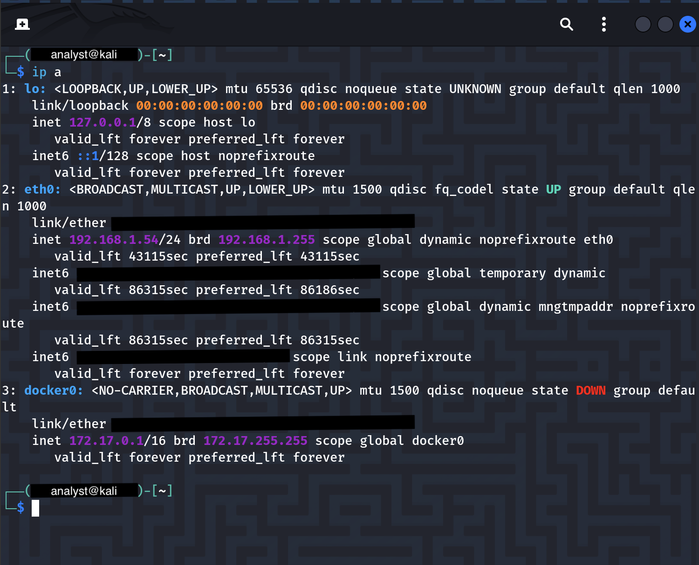
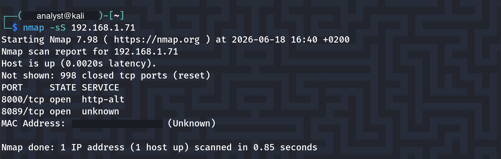
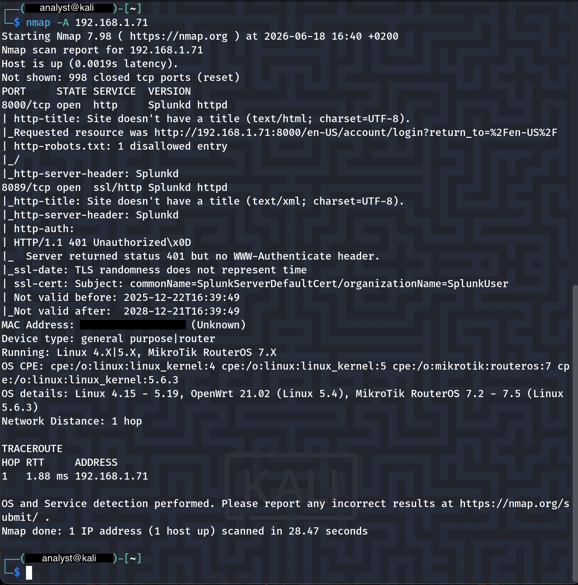
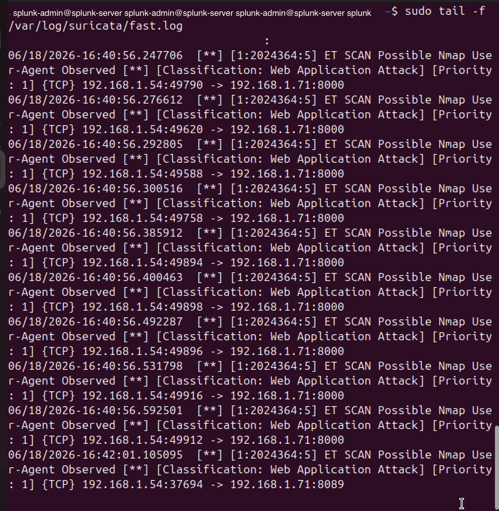
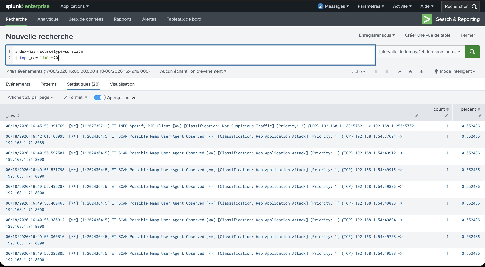

# Projet SOC – Détection d’un scan Nmap avec Suricata et Splunk

## Objectif du projet

Ce projet a pour objectif de mettre en place un petit lab SOC afin de détecter une activité de reconnaissance réseau à l’aide de Suricata et Splunk.

L’idée est de simuler un scan Nmap depuis une machine Kali Linux vers un serveur Splunk, puis de vérifier que l’activité est bien détectée dans les logs Suricata et visible dans Splunk.

Ce projet représente un scénario simple mais réaliste pour un analyste SOC L1 : identifier une activité suspecte, lire les logs réseau, comprendre la source, la destination et interpréter l’alerte.

---

## Environnement du lab

Le lab est composé de plusieurs machines virtuelles sur un réseau local.

| Machine | Rôle | Adresse IP |
|---|---|---|
| Kali Linux | Machine attaquante / génération du scan | 192.168.1.54 |
| Ubuntu / Splunk Server | Serveur cible avec Splunk Enterprise | 192.168.1.71 |
| Suricata | IDS réseau pour détecter les alertes | Sur le serveur Linux |

Services exposés sur le serveur Splunk :

| Port | Service |
|---|---|
| 8000/tcp | Interface Web Splunk |
| 8089/tcp | Port de gestion Splunk |

---

## Outils utilisés

- Kali Linux
- Nmap
- Suricata IDS
- Splunk Enterprise
- Linux Ubuntu
- Fichier de logs `/var/log/suricata/fast.log`

---

## Étape 1 – Vérification de la configuration réseau Kali

Avant de lancer le scan, j’ai vérifié l’adresse IP de la machine Kali avec la commande :

```bash
ip a
```

La machine Kali possède l’adresse IP suivante :

```text
192.168.1.54
```

Cette machine sera utilisée comme source du scan réseau.



---

## Étape 2 – Scan SYN avec Nmap

J’ai lancé un premier scan SYN depuis Kali vers le serveur Splunk :

```bash
nmap -sS 192.168.1.71
```

Le scan a permis d’identifier deux ports ouverts :

```text
8000/tcp open  http-alt
8089/tcp open  unknown
```

Ces ports correspondent à des services utilisés par Splunk.



---

## Étape 3 – Scan avancé avec détection de services

J’ai ensuite lancé un scan plus complet avec détection de version et scripts Nmap :

```bash
nmap -A 192.168.1.71
```

Le résultat confirme la présence de services Splunk :

```text
8000/tcp open  http     Splunkd httpd
8089/tcp open  ssl/http Splunkd httpd
```

Le scan permet également d’identifier des informations supplémentaires sur les services exposés.



---

## Étape 4 – Détection par Suricata

Pendant le scan, Suricata a généré plusieurs alertes dans le fichier :

```bash
/var/log/suricata/fast.log
```

Commande utilisée pour surveiller les alertes en temps réel :

```bash
sudo tail -f /var/log/suricata/fast.log
```

Suricata a détecté l’activité suivante :

```text
ET SCAN Possible Nmap User-Agent Observed
Classification: Web Application Attack
Priority: 1
```

Exemple d’alerte observée :

```text
192.168.1.54 -> 192.168.1.71:8000
192.168.1.54 -> 192.168.1.71:8089
```

Interprétation :

- `192.168.1.54` correspond à la machine Kali.
- `192.168.1.71` correspond au serveur Splunk.
- Les ports ciblés sont `8000` et `8089`.
- Suricata identifie l’activité comme un comportement de scan Nmap.



---

## Étape 5 – Visualisation des alertes dans Splunk

Les logs Suricata ont ensuite été consultés depuis Splunk avec la recherche suivante :

```spl
index=main sourcetype=suricata
| top _raw limit=20
```

Splunk affiche les événements liés aux alertes Suricata, notamment les détections Nmap vers les ports Splunk.

On retrouve les éléments importants :

- Signature : `ET SCAN Possible Nmap User-Agent Observed`
- Classification : `Web Application Attack`
- Priorité : `1`
- Source : `192.168.1.54`
- Destination : `192.168.1.71`
- Ports ciblés : `8000` et `8089`



---

## Analyse SOC

Dans un contexte SOC, cette alerte peut correspondre à une phase de reconnaissance.

Un scan Nmap permet à un attaquant d’identifier :

- les machines actives ;
- les ports ouverts ;
- les services exposés ;
- parfois les versions des services ;
- certaines informations sur le système cible.

Dans ce lab, l’activité est volontaire et contrôlée. Cependant, dans un environnement réel, une alerte de ce type devrait être analysée afin de déterminer si elle provient :

- d’un administrateur réseau ;
- d’un outil de supervision autorisé ;
- d’un scanner de vulnérabilités interne ;
- ou d’une activité suspecte non autorisée.

---

## Mapping MITRE ATT&CK

Cette activité peut être associée à la tactique suivante :

| Tactique | Technique | Description |
|---|---|---|
| Reconnaissance | T1595 - Active Scanning | Scan actif d’une cible pour identifier les services exposés |
| Discovery | T1046 - Network Service Discovery | Découverte des services réseau accessibles |

---

## Conclusion

Ce projet m’a permis de mettre en pratique un scénario simple de détection SOC :

1. Génération d’un scan réseau avec Nmap.
2. Détection de l’activité par Suricata.
3. Collecte et consultation des logs dans Splunk.
4. Analyse de l’alerte à partir de la source, de la destination, du port et de la signature.
5. Interprétation du comportement dans une logique SOC L1.

Ce lab montre ma capacité à comprendre une alerte réseau, à utiliser un SIEM et à expliquer clairement une activité de reconnaissance.

---

## Compétences développées

- Analyse de logs réseau
- Utilisation de Nmap
- Détection IDS avec Suricata
- Recherche d’événements dans Splunk
- Lecture d’alertes de sécurité
- Compréhension source / destination / port / protocole
- Analyse de base SOC L1
- Mapping MITRE ATT&CK
