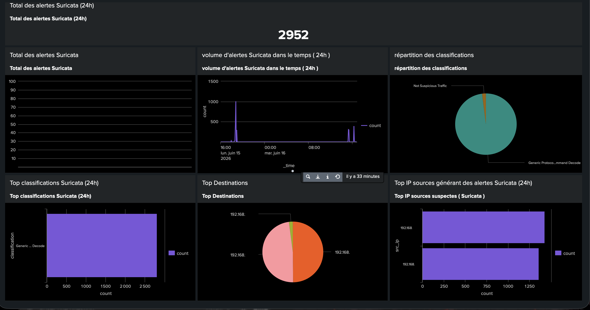
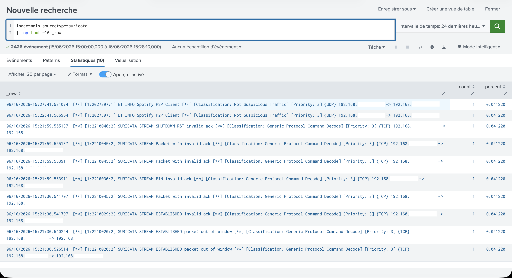
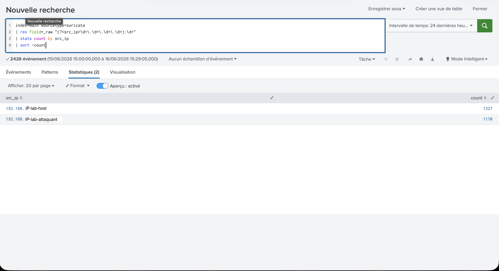

# Test




# Splunk Suricata SOC Lab

## Présentation

Dans ce projet, j'ai mis en place un laboratoire SOC permettant de collecter, centraliser et analyser des événements réseau générés par Suricata dans Splunk Enterprise.

L'objectif était de reproduire un environnement de supervision de sécurité afin de développer des compétences en analyse d'événements, investigation et création de tableaux de bord.

---

## Architecture du laboratoire

### Machine hôte

* macOS

### Machine virtuelle

* Ubuntu Linux

### Outils utilisés

* Splunk Enterprise
* Suricata IDS
* Splunk Universal Forwarder
* Linux Ubuntu

---

## Objectifs du projet

* Déployer Suricata IDS
* Collecter les journaux de sécurité réseau
* Centraliser les événements dans Splunk
* Créer des requêtes SPL d'analyse
* Concevoir un tableau de bord SOC
* Identifier les principales sources d'alertes

---

## Collecte des journaux

Les alertes Suricata sont générées dans le fichier :

```bash
/var/log/suricata/fast.log
```

Les événements sont ensuite indexés dans Splunk avec :

```spl
index=main sourcetype=suricata
```

---

## Vérification de l'indexation

Cette recherche permet de vérifier que les événements sont correctement indexés dans Splunk :

```spl
| eventcount summarize=false index=*
```

### Capture


---

## Analyse des événements Suricata

Cette recherche affiche les événements générés par Suricata :

```spl
index=main sourcetype=suricata
```

### Capture


---

## Requêtes SPL réalisées

### Volume d'alertes dans le temps

```spl
index=main sourcetype=suricata
| timechart count
```

### Top des adresses IP sources

```spl
index=main sourcetype=suricata
| rex field=_raw "(?<src_ip>\d+\.\d+\.\d+\.\d+):\d+"
| stats count by src_ip
| sort -count
```

### Répartition des classifications

```spl
index=main sourcetype=suricata
| rex field=_raw "Classification:\s(?<classification>[^\]]+)"
| stats count by classification
| sort -count
```

### Top des alertes

```spl
index=main sourcetype=suricata
| top limit=10 _raw
```

---

## Analyse des alertes

### Top des alertes



### Top des IP sources



---

## Tableau de bord SOC

Afin de faciliter la supervision des événements de sécurité, un tableau de bord Splunk a été développé.

Le dashboard permet de visualiser :

* Le volume d'alertes sur 24 heures
* Les classifications d'événements Suricata
* Les adresses IP les plus actives
* Les principales destinations observées
* L'évolution des alertes dans le temps

### Capture


---

## Compétences développées

* Administration Linux
* Déploiement de Splunk Enterprise
* Configuration de Suricata IDS
* Collecte et indexation de journaux
* Analyse d'événements réseau
* Création de requêtes SPL
* Investigation SOC
* Création de tableaux de bord de supervision
* Analyse des alertes de sécurité

---

## Résultats

Ce laboratoire m'a permis de reproduire un cas d'usage proche d'un environnement SOC réel.

Les événements générés par Suricata ont été centralisés dans Splunk puis analysés à l'aide de requêtes SPL et de tableaux de bord afin d'identifier les principales activités observées sur le réseau.

---

## Auteur

Bakary Cissé

Projet réalisé dans le cadre de mon parcours de formation vers un poste d'Analyste SOC.
